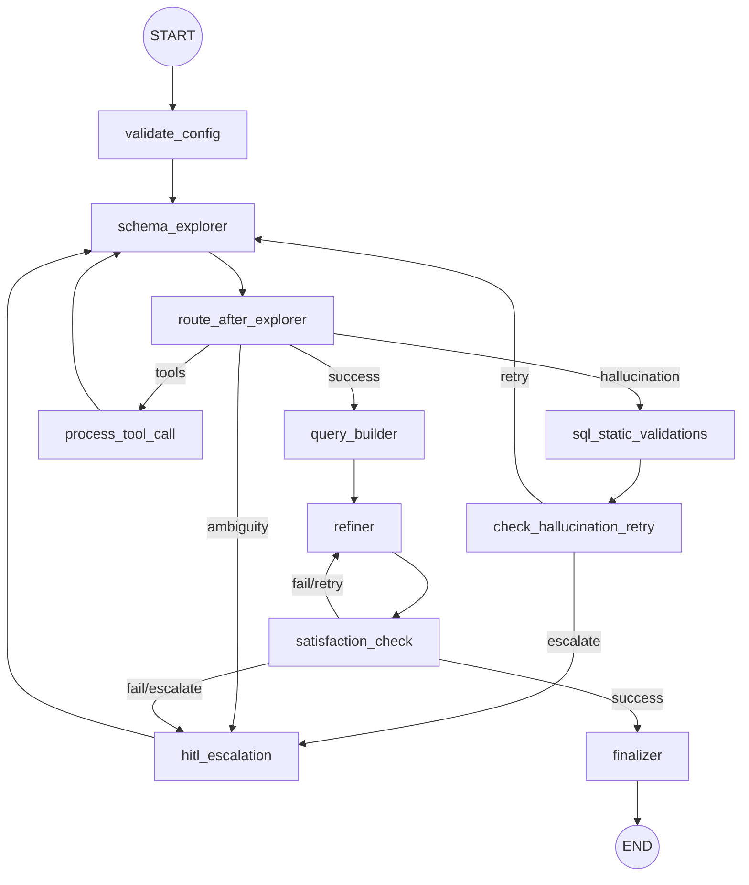

# Text2SQL Agent Service

This service runs the LangGraph-based multi-agent pipeline for translating natural language to SQL.

## Architecture

Below is the execution graph of the agent:

```mermaid
graph TD
    START((START)) --> validate_config
    validate_config --> schema_explorer
    
    schema_explorer --> route_after_explorer
    
    route_after_explorer -- hallucination --> sql_static_validations
    sql_static_validations --> check_hallucination_retry
    check_hallucination_retry -- retry --> schema_explorer
    check_hallucination_retry -- escalate --> hitl_escalation
    
    route_after_explorer -- ambiguity --> hitl_escalation
    route_after_explorer -- tools --> process_tool_call
    process_tool_call --> schema_explorer
    route_after_explorer -- success --> query_builder
    
    hitl_escalation --> schema_explorer
    
    query_builder --> refiner
    refiner --> satisfaction_check
    
    satisfaction_check -- success --> finalizer
    satisfaction_check -- fail/retry --> refiner
    satisfaction_check -- fail/escalate --> hitl_escalation
    
    finalizer --> END((END))
```

