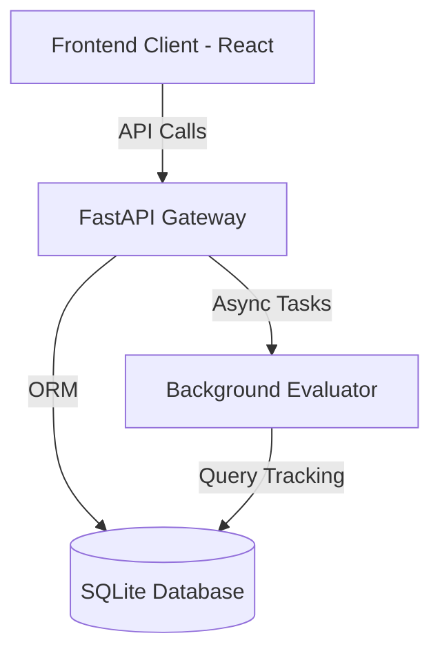

# System Architecture

The TextToSQL Studio platform is split into a modular backend and highly dynamic frontend structure designed for speed and reliability.

## Tech Stack

### Backend
- **Framework**: FastAPI (Python 3.12)
- **ORM / Database Model**: SQLModel (built on SQLAlchemy)
- **Database Engine**: SQLite (Local development)
- **Background Tasks**: FastAPI `BackgroundTasks` (Evaluating sets asynchronously)

### Frontend
- **Runtime**: Vite + React + TypeScript
- **State & Data Fetching**: TanStack Query (React Query)
- **Styling**: Vanilla CSS (Tailored glassmorphic and high-fidelity micro-interactions)
- **Component Libraries**: Ant Design (App Contexts), Lucide React (Icons)

## Core Modules

1. **Table Lifecycle Registry**: Manages metadata and the progression of tables from `draft` through `sandbox` to `production`.
2. **Evaluation & Sandbox Engine**: Runs regression queries against static golden sets to compute data reliability.
3. **Audit Engine**: Captures access frequencies, SQL configurations, and execution metrics.
